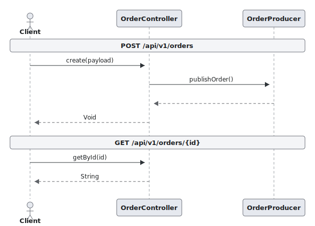
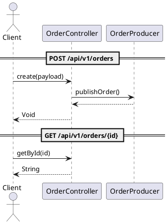
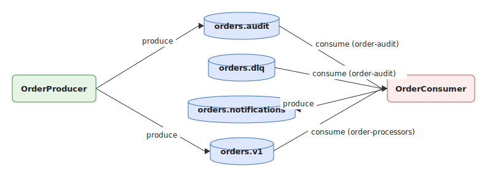
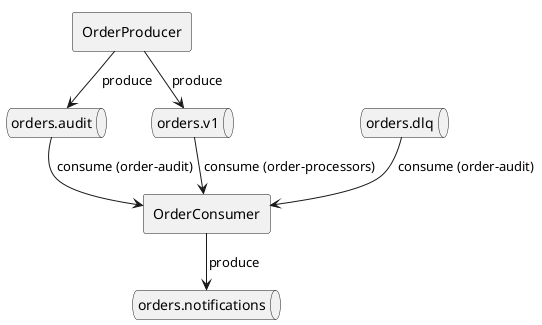
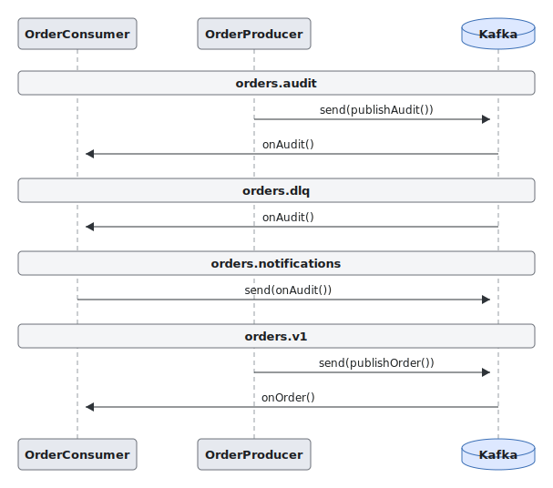
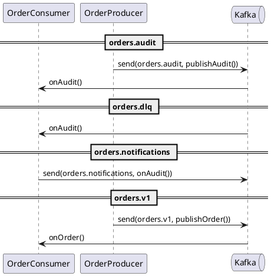

# Fixtures demo

- Controllers: **1**, endpoints: **2**
- Kafka topics: **4** (producers: 3, consumers: 2)

## Endpoints

| Method | Path | Handler | Params |
|---|---|---|---|
| POST | /api/v1/orders | OrderController.create | body:payload |
| GET | /api/v1/orders/{id} | OrderController.getById | path:id |

### OrderController

_File: `/Users/iskandergabdrahmanov/Documents/dev/StorageService/StorageService/.gigacode/skills/java-uml-spec/test/fixtures/com/example/OrderController.java`_

| Field | Type |
|---|---|
| orderProducer | OrderProducer |

PlantUML source

## Kafka

### Topics

| Topic | Producers | Consumers |
|---|---|---|
| orders.audit | OrderProducer | OrderConsumer |
| orders.dlq | — | OrderConsumer |
| orders.notifications | OrderConsumer | — |
| orders.v1 | OrderProducer | OrderConsumer |

### Producers

| Class | Method | Topics | File |
|---|---|---|---|
| OrderConsumer | onAudit | orders.notifications | /Users/iskandergabdrahmanov/Documents/dev/StorageService/StorageService/.gigacode/skills/java-uml-spec/test/fixtures/com/example/OrderConsumer.java |
| OrderProducer | publishAudit | orders.audit | /Users/iskandergabdrahmanov/Documents/dev/StorageService/StorageService/.gigacode/skills/java-uml-spec/test/fixtures/com/example/OrderProducer.java |
| OrderProducer | publishOrder | orders.v1 | /Users/iskandergabdrahmanov/Documents/dev/StorageService/StorageService/.gigacode/skills/java-uml-spec/test/fixtures/com/example/OrderProducer.java |

### Consumers

| Class | Method | Topics | Group | File |
|---|---|---|---|---|
| OrderConsumer | onAudit | orders.audit, orders.dlq | order-audit | /Users/iskandergabdrahmanov/Documents/dev/StorageService/StorageService/.gigacode/skills/java-uml-spec/test/fixtures/com/example/OrderConsumer.java |
| OrderConsumer | onOrder | orders.v1 | order-processors | /Users/iskandergabdrahmanov/Documents/dev/StorageService/StorageService/.gigacode/skills/java-uml-spec/test/fixtures/com/example/OrderConsumer.java |

### Component diagram

PlantUML source

### Sequence diagram

PlantUML source

