# StorageService — API & Kafka spec

- Controllers: **9**, endpoints: **20**
- Kafka topics: **0** (producers: 0, consumers: 0)

## Endpoints

| Method | Path | Handler | Params |
|---|---|---|---|
| POST | /api/v2/artifact/new | ArtifactController.addNewArtifact | body:request |
| POST | /api/v2/artifact/{count}/generate | ArtifactController.generateSomeArtifacts | path:count |
| GET | /api/v2/artifact | ArtifactController.getByJsonField | query:key, query:value |
| POST | /api/v2/artifact/json | ArtifactController.getByNativeJsonFields | body:request |
| POST | /api/v2/artifact/customFields | ArtifactController.getCustomRequestById | body:request |
| GET | /api/v2/artifact/getById | ArtifactController.getById | query:id |
| POST | /api/v2/contract/new | ContractController.addNewContract | body:dto |
| GET | /api/v2/contract | ContractController.getByName | query:name |
| POST | /api/v2/contract/{count}/generate | ContractController.generateContracts | path:count |
| POST | /api/v2/documentType/new | DocumentTypeController.addNewDocumentType | body:request |
| GET | /api/v2/documentType | DocumentTypeController.getDocumentType | query:documentTypeName |
| POST | /api/v2/dd | DynamicDocumentController.addNewDocument | body:request |
| ANY | /api/v2/dd/new | DynamicDocumentController.addNewDocument | body:request |
| POST | /api/v2/insurance/new | InsuranceController.addNewInsurance | body:dto |
| GET | /api/v2/primaryCache | PrimaryCacheController.get | query:key |
| POST | /api/v2/primaryCache/{key}/{value}/add | PrimaryCacheController.add | path:key, path:value |
| ANY | /api/v2/propertyType/new | PropertyTypeController.addNewPropertyType | body:request |
| GET | /api/v2/propertyType | PropertyTypeController.getPropertyTypeByNameAndDocType | query:propertyTypeName, body:request |
| ANY | / | RootController.root | — |
| GET | /api/v2/zk | ZkController.getConfig | — |

### ArtifactController

_File: `/Users/iskandergabdrahmanov/Documents/dev/StorageService/StorageService/src/main/java/com/storage/storageservice/controller/ArtifactController.java`_

| Field | Type |
|---|---|
| service | ArtifactService |

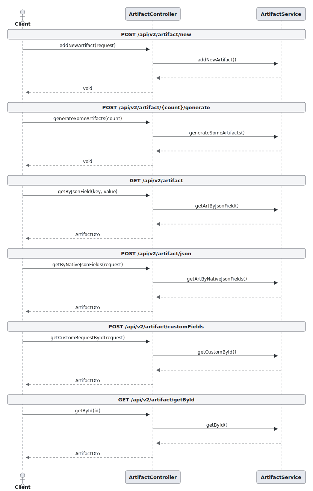

PlantUML source

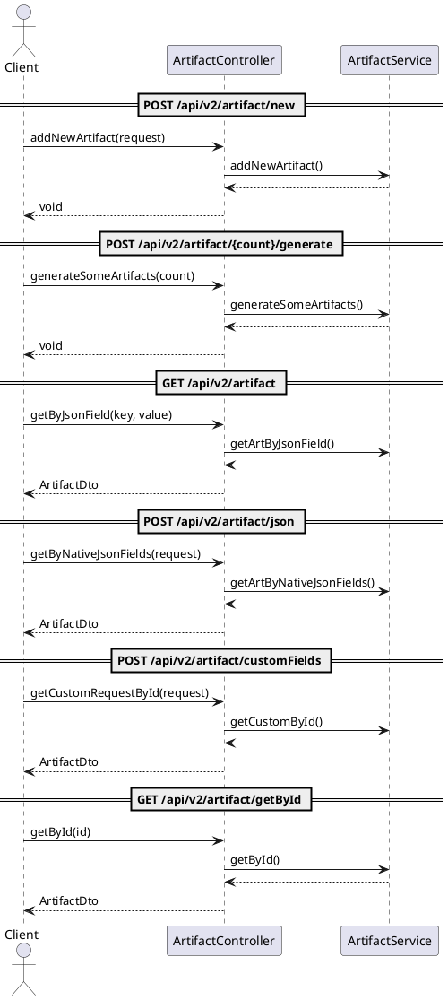

### ContractController

_File: `/Users/iskandergabdrahmanov/Documents/dev/StorageService/StorageService/src/main/java/com/storage/storageservice/controller/ContractController.java`_

| Field | Type |
|---|---|
| contractService | ContractService |

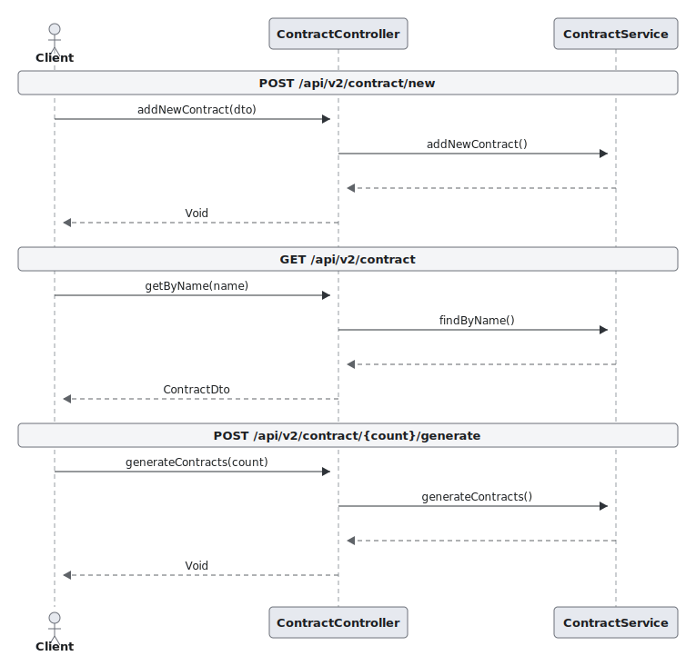

PlantUML source

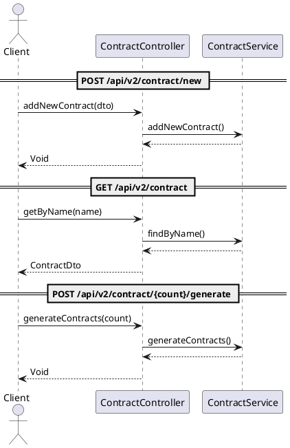

### DocumentTypeController

_File: `/Users/iskandergabdrahmanov/Documents/dev/StorageService/StorageService/src/main/java/com/storage/storageservice/controller/DocumentTypeController.java`_

| Field | Type |
|---|---|
| service | DocumentTypeService |

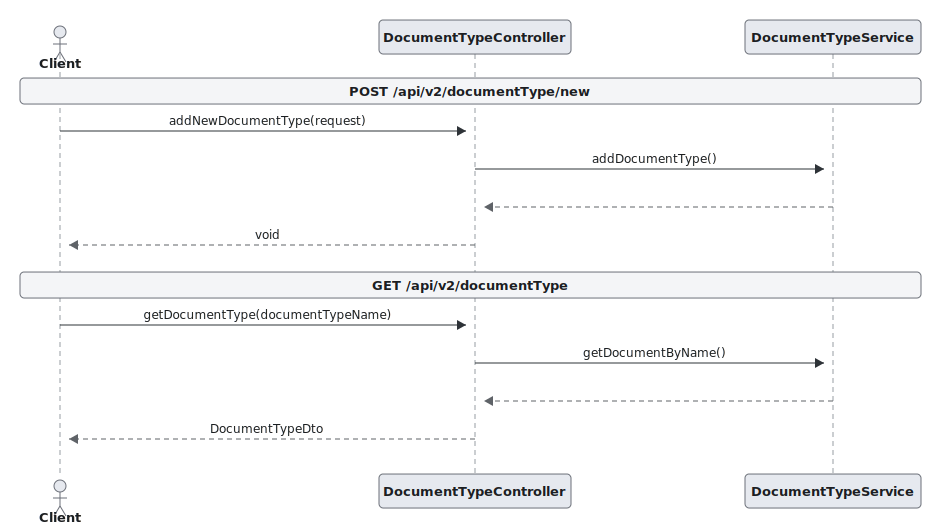

PlantUML source

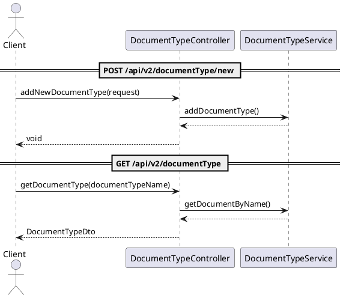

### DynamicDocumentController

_File: `/Users/iskandergabdrahmanov/Documents/dev/StorageService/StorageService/src/main/java/com/storage/storageservice/controller/DynamicDocumentController.java`_

| Field | Type |
|---|---|
| service | DynamicDocumentService |

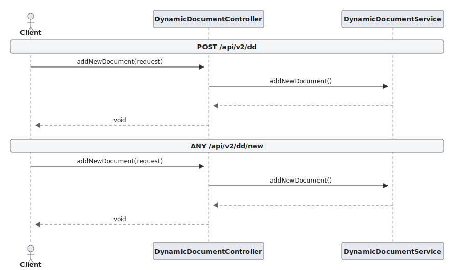

PlantUML source

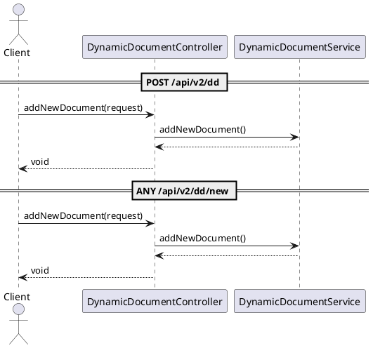

### InsuranceController

_File: `/Users/iskandergabdrahmanov/Documents/dev/StorageService/StorageService/src/main/java/com/storage/storageservice/controller/InsuranceController.java`_

| Field | Type |
|---|---|
| insuranceService | InsuranceService |

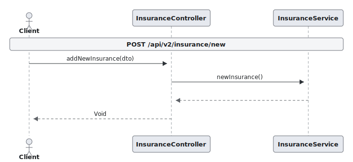

PlantUML source

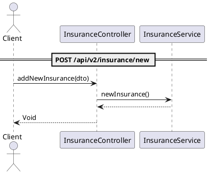

### PrimaryCacheController

_File: `/Users/iskandergabdrahmanov/Documents/dev/StorageService/StorageService/src/main/java/com/storage/storageservice/controller/PrimaryCacheController.java`_

| Field | Type |
|---|---|
| primaryCacheService | CacheService |

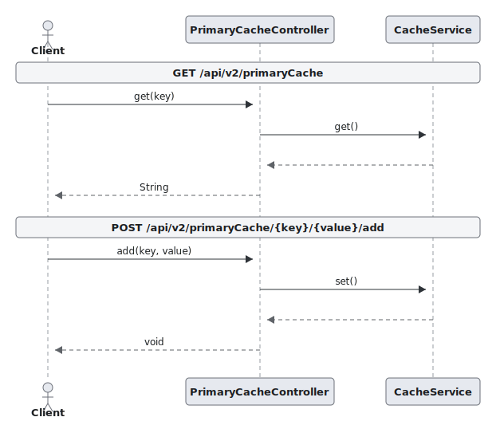

PlantUML source

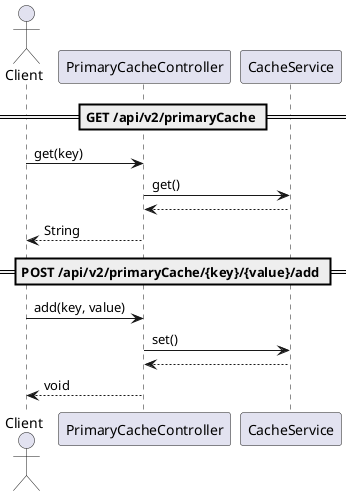

### PropertyTypeController

_File: `/Users/iskandergabdrahmanov/Documents/dev/StorageService/StorageService/src/main/java/com/storage/storageservice/controller/PropertyTypeController.java`_

| Field | Type |
|---|---|
| propertyTypeService | PropertyTypeService |

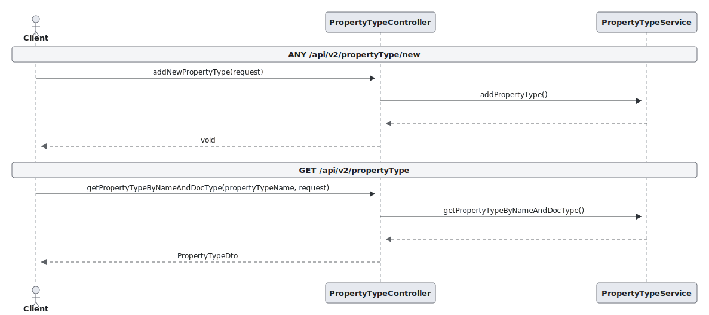

PlantUML source

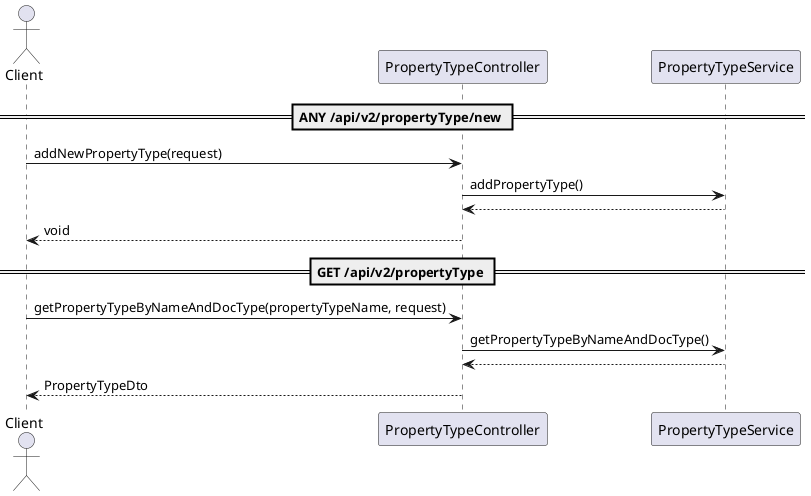

### RootController

_File: `/Users/iskandergabdrahmanov/Documents/dev/StorageService/StorageService/src/main/java/com/storage/storageservice/controller/RootController.kt`_

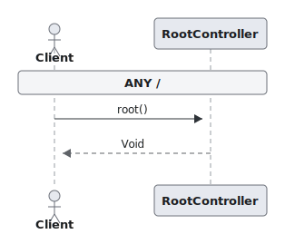

PlantUML source

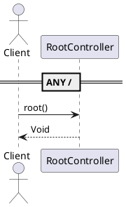

### ZkController

_File: `/Users/iskandergabdrahmanov/Documents/dev/StorageService/StorageService/src/main/java/com/storage/storageservice/controller/ZkController.java`_

| Field | Type |
|---|---|
| zkConfigWatcher | ZkConfigWatcher |

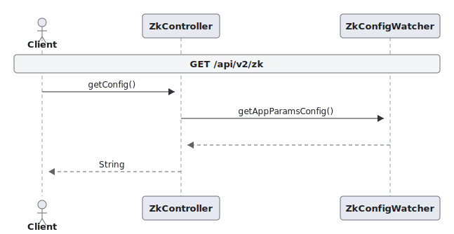

PlantUML source

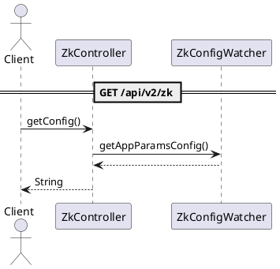

