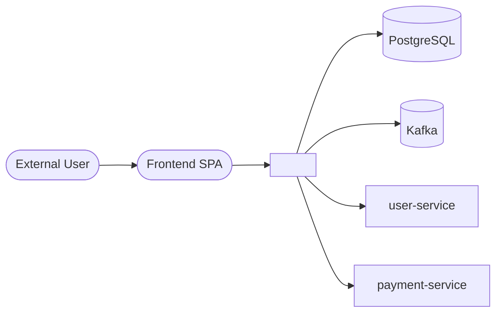
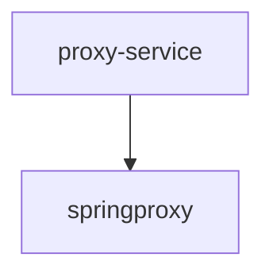
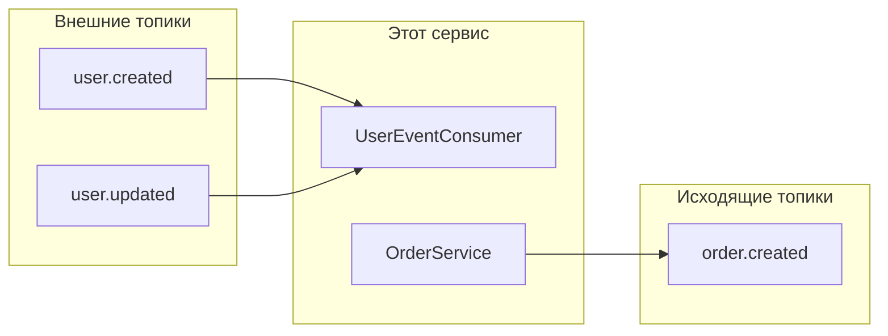
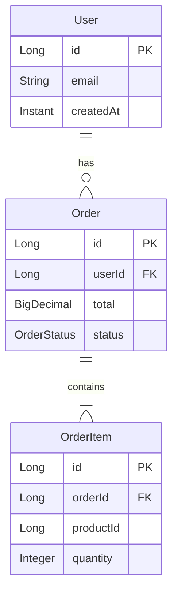
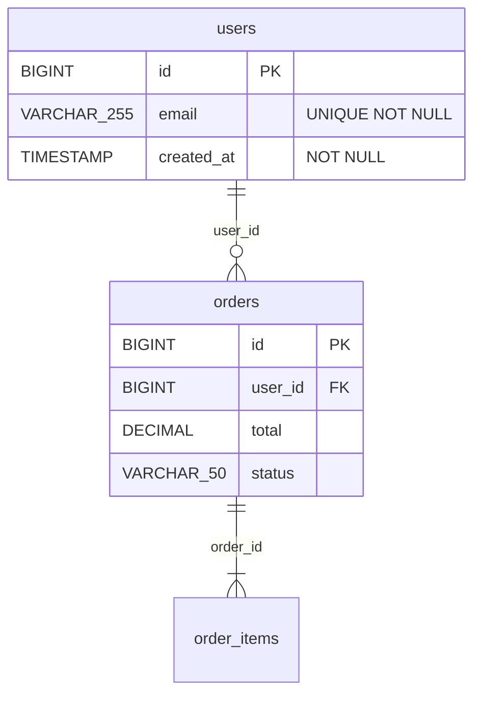
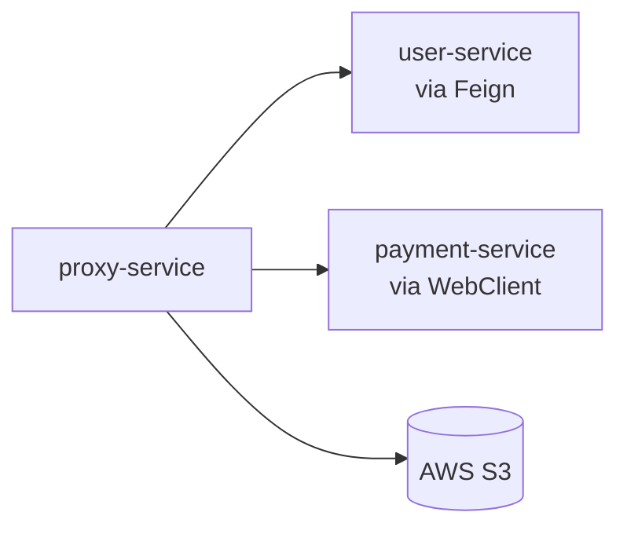
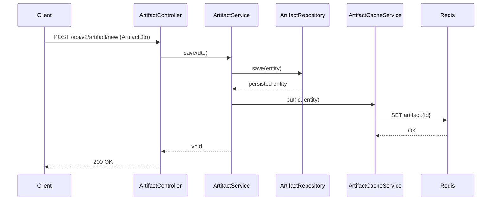
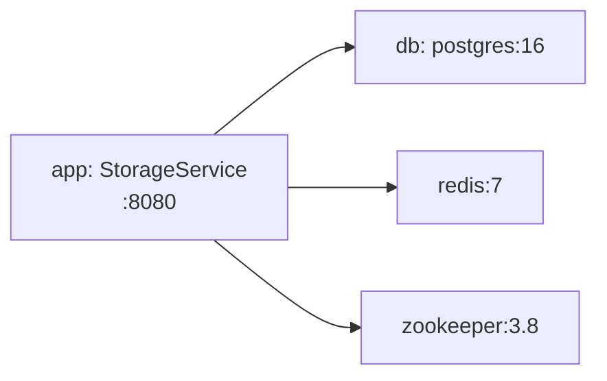

# Шаблоны MD-выхода system-analyst

Все файлы попадают в `<docs_path>/system-analysis/`. Главный агент собирает их из
JSON-ответов субагентов. Структура файлов и заголовков — фиксированная, чтобы
переагенерации давали предсказуемые diffs.

Все диаграммы — Mermaid в ```mermaid блоках (GitHub-flavoured Markdown).

---

## README.md

```markdown
# Системный обзор: <project-name>

> Сгенерирован `system-analyst` <дата ISO>. Источник — снимок репозитория
> на коммите `<short sha>`. Не правь руками — будет перетёрто следующим запуском.

## Сводка

- **Система сборки:** Gradle 8.x
- **Spring Boot:** 3.2.1
- **Java:** 17
- **Модулей:** 3 (`<имена>`)
- **REST endpoint:** 24
- **Async listeners:** 8 (Kafka), 0 (RabbitMQ)
- **JPA entities:** 18
- **Таблиц в схеме:** 12 (Flyway, 47 миграций)
- **Внешних клиентов:** 4 (Feign), 2 (WebClient)

## Содержание

- [Структура проекта](structure.md) — модули и их зависимости
- [REST API](api.md) — каталог эндпоинтов
- [Async (Kafka/RabbitMQ)](async.md) — продьюсеры и консьюмеры
- [Доменная модель](domain.md) — JPA-сущности и связи
- [Схема БД](db.md) — таблицы, индексы, FK из миграций
- [Внешние интеграции](integrations.md) — Feign / WebClient / SDK
- [Конфигурация](config.md) — профили и ключевые свойства
- [Сквозные аспекты](cross-cutting.md) — фильтры, AOP, scheduled, события

## C4 — Context



> Диаграмма выведена из найденных интеграций. Внешние акторы (User, Frontend) —
> предположение, проверь.
```

---

## structure.md

```markdown
# Структура проекта

## Модули

| Модуль | Путь | Тип | Зависит от | Spring Boot Application |
|---|---|---|---|---|
| `proxy-service` | `proxy-service/` | app | `springproxy` | `com.example.proxy.ProxyApplication` |
| `springproxy` | `springproxy/` | lib | — | — |
| (root) | `.` | parent | — | — |

## Граф зависимостей



## Application entry points

- `com.example.proxy.ProxyApplication` (proxy-service) — основной HTTP-сервис.

## Технологический стек

- **Build:** Gradle 8.x (Kotlin DSL: нет)
- **Java:** 17
- **Spring Boot:** 3.2.1
- **Lombok:** да
- **Тесты:** JUnit 5, AssertJ
- **БД-миграции:** Flyway
- **OpenAPI:** springdoc (если найден)
```

---

## api.md

```markdown
# REST API

> OpenAPI: доступен по `/v3/api-docs` (springdoc). Если поднят локально — UI на
> `/swagger-ui.html`.

## Каталог эндпоинтов

| Модуль | Метод | Путь | Контроллер | Security |
|---|---|---|---|---|
| proxy-service | `GET` | `/api/v1/users/{id}` | `UserController#getUser` | `hasRole('USER')` |
| proxy-service | `POST` | `/api/v1/users` | `UserController#createUser` | `hasRole('ADMIN')` |
| ... | ... | ... | ... | ... |

## По модулям

### proxy-service (15 endpoint)

#### UserController (`/api/v1/users`)
- `GET /{id}` — `getUser(id) → UserResponse`
- `POST /` — `createUser(@RequestBody CreateUserRequest) → UserResponse`
- ...

### springproxy (9 endpoint)

...

## Группировка по доменам

(Если из путей очевидно: `/api/v1/users/*` — users domain, `/api/v1/orders/*` — orders.)

- **Users:** 8 endpoint
- **Orders:** 12 endpoint
- **Health:** 4 endpoint
```

---

## async.md

```markdown
# Асинхронные интеграции

## Kafka

### Consumers (`@KafkaListener`)

| Модуль | Класс | Метод | Топики | Group ID | Payload |
|---|---|---|---|---|---|
| proxy-service | `UserEventConsumer` | `onUserCreated` | `user.created`, `user.updated` | `proxy-users` | `UserEvent` |

### Producers (`KafkaTemplate.send`)

| Модуль | Класс | Топик | Payload |
|---|---|---|---|
| proxy-service | `OrderService#publishOrderCreated` | `order.created` | `OrderEvent` |

## RabbitMQ

(Если не используется — пропустить раздел.)

## Поток сообщений


```

---

## domain.md

```markdown
# Доменная модель (из кода)

> ERD ниже выведен из аннотаций @Entity / @OneToMany / @ManyToOne и т.п.
> Реальная схема БД — см. [db.md](db.md). Расхождения = повод посмотреть.

## ER-диаграмма



## Сущности

### User (`com.example.proxy.entity.User`)
- **Таблица:** `users`
- **Module:** proxy-service
- **Поля:**
  - `id: Long` (PK, @Id)
  - `email: String` (NOT NULL)
  - `createdAt: Instant` (NOT NULL)
- **Связи:**
  - `@OneToMany(mappedBy="user") orders: List<Order>`

### Order (`...`)
...

## Embeddables

- `Address` — поля: `city, street, zip`. Используется в: `User#address`.
```

---

## db.md

```markdown
# Схема БД (из миграций)

> Восстановлено из Flyway-миграций `src/main/resources/db/migration/` (47 файлов).
> Это **симуляция применения**, не дамп реальной БД. Реальное состояние может
> отличаться (вручную добавленные индексы, изменённые типы и т.п.).

## ER-диаграмма



## Таблицы

### `public.users`

| Колонка | Тип | NULL | Default | PK |
|---|---|---|---|---|
| `id` | BIGINT | NOT NULL | nextval('users_id_seq') | ✓ |
| `email` | VARCHAR(255) | NOT NULL | — | |
| `created_at` | TIMESTAMP | NOT NULL | now() | |

**Индексы:** `idx_users_email (email, unique)`

**FK:** —

### `public.orders`
...

## Миграции

- 47 миграций (Flyway)
- Последняя: `V47__add_status_to_orders.sql`

### Пропущенные при парсинге

(Если db-mapper не смог распарсить какие-то миграции — список здесь.)

- `V23__custom_pgsql_function.sql` — содержит CREATE FUNCTION с PL/pgSQL,
  пропущено из реконструкции.
```

---

## integrations.md

```markdown
# Внешние интеграции

## Исходящие HTTP

### Feign-клиенты

| Модуль | Класс | Имя сервиса | URL (из конфига) | Методы |
|---|---|---|---|---|
| proxy-service | `UserApiClient` | `user-service` | `${user.service.url}` | 3 |

### WebClient / RestTemplate

| Модуль | Класс | Тип | Базовый URL | Методы |
|---|---|---|---|---|
| proxy-service | `PaymentClient` | WebClient | `${payment.base-url}` | charge, refund |

## SDK

| SDK | Импорт | Использующие классы |
|---|---|---|
| AWS S3 | `com.amazonaws.services.s3.*` | `FileStorageService` |

## gRPC

(Если не используется — пропустить.)

## Карта интеграций


```

---

## config.md

```markdown
# Конфигурация

## Профили

`default`, `dev`, `prod`, `test`

## Ключевые свойства (per profile)

| Свойство | default | dev | prod | test |
|---|---|---|---|---|
| `server.port` | 8080 | 8080 | 9090 | random |
| `spring.datasource.url` | — | `${DEV_DB_URL}` | `${PROD_DB_URL}` | h2 in-memory |
| `spring.kafka.bootstrap-servers` | — | `${DEV_KAFKA}` | `${PROD_KAFKA}` | embedded |
| `logging.level.root` | INFO | DEBUG | INFO | INFO |

## Feature flags

| Флаг | dev | prod |
|---|---|---|
| `app.feature.new-checkout` | true | false |
| `app.feature.audit-async` | true | true |

## Заметки

- Все секреты (`***`) — через env vars или Vault, в проекте не хранятся.
- `bootstrap.yml` найден в `proxy-service` — Spring Cloud Config используется.
```

---

## cross-cutting.md

```markdown
# Сквозные аспекты

## Фильтры

| Модуль | Класс | Порядок | Цель |
|---|---|---|---|
| proxy-service | `AuthFilter` | 1 | Проверяет JWT в Authorization header |
| proxy-service | `CorrelationIdFilter` | 0 | Извлекает/генерирует X-Correlation-Id |

## Интерсепторы

| Модуль | Класс | Цель |
|---|---|---|
| proxy-service | `AuditInterceptor` | Логирует body запроса для аудита |

## AOP-аспекты

| Модуль | Класс | Тип advice | Pointcut | Цель |
|---|---|---|---|---|
| proxy-service | `MetricsAspect` | @Around | `@within(MetricsTracked)` | Замер времени выполнения |

## Scheduled tasks

| Модуль | Класс | Метод | Расписание | Цель |
|---|---|---|---|---|
| proxy-service | `CleanupJob` | `deleteOldRecords` | cron: `0 0 3 * * *` | Удаление старше 30 дней |

## События

### Publishers

| Класс | Публикует |
|---|---|
| `OrderService` | `OrderCreatedEvent`, `OrderCancelledEvent` |

### Listeners

| Класс | Метод | Событие | Цель |
|---|---|---|---|
| `OrderEventListener` | `onOrderCreated` | `OrderCreatedEvent` | Отправка в Kafka |

## Security configuration

- **`SecurityConfig`** (proxy-service) — JWT-based auth.
  - `/api/**` → требует `ROLE_USER`.
  - `/admin/**` → требует `ROLE_ADMIN`.
  - `/health`, `/actuator/**` → permitAll.
```

---

## Правила сборки MD главным агентом

1. **Всегда генерируй README.md** — даже если скоуп частичный (просто меньше
   ссылок).
2. **Не выдумывай данные.** Если для какого-то поля JSON-ответ от субагента
   пустой — ставь `—` или пропускай столбец. Не пиши "TODO" или "tbd".
3. **Пиши количество в сводке точно.** Если 0 entities — пиши "0 entities", а
   не "несколько entities".
4. **Mermaid-ограничения:**
   - Имена узлов без точек, замени `.` на `_` или `<br/>` для переноса.
   - В erDiagram имена таблиц без специальных символов.
   - Если граф больше 30 узлов — разбей на под-диаграммы по модулям.
5. **Стиль таблиц** — без trailing whitespace, выравнивание по самой длинной
   ячейке столбца не требуется, GitHub отрендерит.

---

## use-cases.md

```markdown
# Use Cases

> Топ-5 типичных сценариев. Не исчерпывающий список — выборка чтобы показать,
> как течёт запрос через слои.

## 1. Создание артефакта

**Точка входа:** `POST /api/v2/artifact/new` (`ArtifactController#addNewArtifact`)

**Что делает:** клиент отправляет ArtifactDto → сохраняется в БД → кладётся в Redis.



**Заметки:** транзакция управляется на уровне сервиса. Кэш обновляется **после**
персиста.

## 2. Поиск артефакта по JSON-полю

...
```

---

## glossary.md

```markdown
# Глоссарий

> Доменные термины с попыткой их различить. Если из кода что-то неясно — это
> явно отмечено `[неясно из кода]` или `[гипотеза]`.

## Сущности

### Artifact
- **Класс:** `com.storage.storageservice.model.Artifact`
- **Тип:** entity
- **Суть:** хранимая единица с произвольным JSON-payload, поддерживает иерархию
  parent/children, ассоциирована с Employee.
- **Ключевые поля:** `name`, `surname`, `payload (jsonb)`, `parent`, `employee`
- **Где используется:** `ArtifactController`, `ArtifactService`

### Document
...

## Группы связанных терминов

### Document family

В коде сосуществуют **`Document`, `Contract`, `Insurance`, `DynamicDocument`** —
это связано, но не одно и то же.

| Термин | Базовая роль | Особенности |
|---|---|---|
| `Document` | Абстрактный родитель | JOINED-наследование, поля name/surname/createDateTime |
| `Contract` | Конкретный поддокумент | Добавляет `contractText` |
| `Insurance` | Конкретный поддокумент | Добавляет `vehicleType` |
| `DynamicDocument` | **Параллельная иерархия** | НЕ наследник Document. Поля задаются в рантайме через `DynamicFieldInfoStr`. |

**Разница в схемах:** Document/Contract/Insurance — стат-типизированы, схема
известна. DynamicDocument — поля собираются в рантайме из набора
`PropertyType` (метаданные).

## Enums и константы

(Если есть — список значений и где используется.)
```

---

## operations.md

```markdown
# Operations / DevOps

## Контейнеризация

### Dockerfile

| Параметр | Значение |
|---|---|
| Base image | `eclipse-temurin:21-jre` |
| Exposed ports | 8080 |
| Entrypoint | `java -jar /app.jar` |

### compose.yaml



| Сервис | Образ | depends_on | Volumes |
|---|---|---|---|
| `app` | (build из Dockerfile) | db, redis, zookeeper | — |
| `db` | `postgres:16` | — | `db-data` |
| `redis` | `redis:7-alpine` | — | — |
| `zookeeper` | `zookeeper:3.8` | — | — |

## Build-команды (Gradle)

| Задача | Что делает |
|---|---|
| `./gradlew bootRun` | Запуск приложения |
| `./gradlew build` | Сборка + тесты |
| `./gradlew test` | Только тесты |
| `./gradlew jacocoTestReport` | Отчёт покрытия |

## Ожидаемые env-переменные

| Переменная | Default | Категория | Источник |
|---|---|---|---|
| `DB_URL` | `jdbc:postgresql://db:5432/mydatabase` | database | `application.yml` |
| `REDIS_HOST` | `localhost` | cache | `application.yml` |
| `REDIS_PORT` | `6379` | cache | `application.yml` |
| `STORAGE_SERVICE_URL` | `http://localhost:8080` | upstream | `proxy-service/application.yml` |

## Actuator / Health

- Включён только в профиле `docker` (модуль springproxy).
- Доступные эндпоинты: `health`, `info`, `metrics`.

## Логирование

| Параметр | Значение |
|---|---|
| Config file | `proxy-service/src/main/resources/logback.xml` (только для proxy-service) |
| Формат | стандартный Spring Boot формат |
| Уровни | см. [config.md](config.md) |

## Quickstart (из README проекта)

(Если есть — копия инструкции. Если нет — пометить "README не содержит
quickstart".)
```
