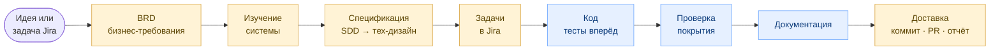
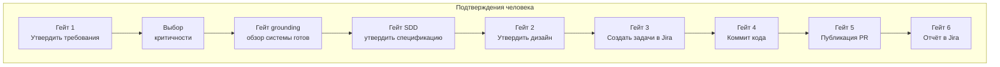
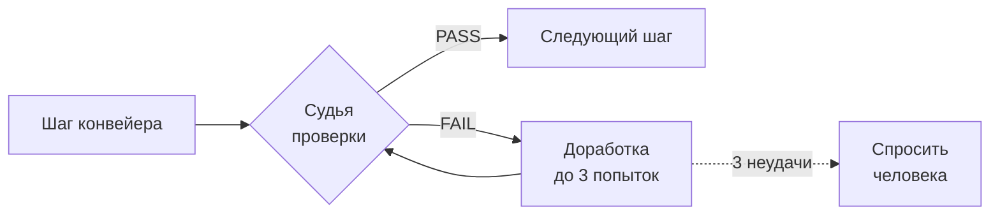

# Feature Pipeline — документ для бизнеса

> **Кому:** product owner, бизнес-аналитик, тимлид, заказчик.
> **О чём:** что делает конвейер, какие шаги проходит фича, где человек принимает решения,
> и **сколько времени экономит команда**.
> Технические детали (скрипты, гейты, хуки) — в [pipeline-technical.md](pipeline-technical.md).

---

## 1. В одном абзаце

Feature Pipeline — это управляемый конвейер, который проводит **новую фичу** от идеи до
готового, проверенного кода и pull request. Он сам выполняет рутину между контрольными точками
(собрать требования, изучить систему, спроектировать, написать код по тестам, прогнать покрытие,
обновить документацию, создать PR), но **ничего необратимого не делает без явного «да» человека**:
задачи в Jira, коммит, публикация, отчёт — только после подтверждения.

**Главная идея:** качество встроено в процесс, а не держится на «доброй воле». На каждом шаге
работает автоматическая проверка-судья — пропустить тесты, выкатить без покрытия или сделать
рискованное «молча» нельзя.

---

## 2. Маршрут фичи: от идеи до PR

🟦 синие шаги — конвейер делает сам · 🟨 жёлтые — точки, где человек говорит «да».
Жёлтых точек больше одной на узел там, где их несколько: «Спецификация» = подтверждение
SDD и дизайна; «Доставка» = коммит, публикация PR и отчёт. Плюс сразу после BRD —
**выбор критичности**. Автономно (без участия человека) идут Код, Покрытие и Документация.

---

## 3. Что происходит на каждом шаге (без жаргона)

| Шаг | Что делает | Зачем бизнесу |
|---|---|---|
| **1. Требования (BRD)** | Короткое интервью по вопросам, затем оформляет документ требований на языке бизнеса | Единое понимание задачи; ничего «не так поняли» |
| **2. Изучение системы** | Разбирается, как устроен сервис (модули, данные, интеграции) | Не ломаем существующее; не изобретаем то, что уже есть |
| **3. Спецификация (SDD)** | Строгая спецификация поведения (сценарии, ошибки) до проектирования | Договорились, ЧТО делаем, прежде чем решать КАК |
| **4. Тех-дизайн** | План реализации по спецификации + разбивка на задачи | Прозрачная оценка объёма до старта кода |
| **5. Задачи в Jira** | Заводит Story и подзадачи по плану | Трекинг и видимость для всей команды |
| **6. Код (тесты вперёд)** | Пишет сначала тесты, потом код, который их проходит | Меньше багов, меньше переделок |
| **7. Покрытие** | Догоняет тесты до нужного порога качества | Объективная планка, а не «вроде работает» |
| **8. Документация** | Обновляет спецификацию сервиса | Документация не отстаёт — обычно её забывают |
| **9. Доставка (PR + отчёт)** | Создаёт ветки, коммиты, pull request и отчёт в Jira | Готово к ревью; история решений сохранена |

---

## 4. Где человек главный: контрольные точки

Конвейер **автономен между гейтами**, но необратимое — только с подтверждением. Нумерованные
**Гейты 1–6** — ключевые точки; плюс именованные подтверждения (критичность, grounding,
спецификация), которые тоже требуют «да».

**Выбор критичности фичи** идёт сразу после требований (низкая / средняя / высокая). Чем выше
критичность (платежи, персональные данные, инфраструктура), тем строже конвейер требует
подтверждений и доказательств перед каждым шагом.

> Нумерация Гейтов (1–6) не привязана к номерам шагов: Гейты 4, 5, 6 (коммит, PR, отчёт) — это
> три подтверждения на финальном шаге **Доставка**, а не на разных этапах.

---

## 5. Где экономится время команды

Это ключевой эффект. Ниже — типовая фича среднего размера в Java/Spring-сервисе.
Оценки иллюстративные, диапазон зависит от сложности.

| Этап | Вручную | С конвейером | Что экономит |
|---|---|---|---|
| Сбор и оформление требований | 1–2 дня | 1–2 часа | Структура и черновик — автоматически |
| Погружение в незнакомый сервис | 0.5–1 день | минуты (переиспользуется) | Карта системы собирается один раз |
| Спецификация (SDD) + тех-дизайн + разбивка задач | ~1 день | ~1 час | Спека и готовый план по слоям |
| Заведение задач в Jira | 1–2 часа | минуты | Story + подзадачи по плану |
| Доведение тестов до покрытия | 0.5–1 день | ассистировано | Догон покрытия автоматизирован |
| Обновление документации | 0.5 дня *(часто пропускают)* | минуты | Спека не отстаёт |
| Ветки, PR, отчёт в Jira | 1–2 часа | минуты | Stacked-PR и отчёт собираются сами |

```mermaid
gantt
    title Типовая фича: время по этапам (иллюстративно)
    dateFormat X
    axisFormat %s
    section Вручную
    Требования        :0, 12
    Погружение        :12, 8
    Дизайн            :20, 8
    Jira              :28, 2
    Тесты/покрытие    :30, 8
    Документация      :38, 4
    PR + отчёт        :42, 2
    section С конвейером
    Требования        :0, 2
    Погружение        :2, 1
    Дизайн            :3, 1
    Jira              :4, 1
    Тесты/покрытие    :5, 3
    Документация      :8, 1
    PR + отчёт        :9, 1
```

**Три самых крупных выигрыша:**

1. **Онбординг и погружение.** Карта системы собирается один раз и переиспользуется —
   новому разработчику не нужно дни разбираться «что тут вообще происходит».
2. **Документация, которую обычно не делают.** Спецификация обновляется автоматически на каждой
   фиче, а не «когда-нибудь потом» (то есть никогда).
3. **Меньше переделок.** Тесты вперёд + автоматические проверки качества ловят проблемы до ревью,
   а не после релиза.

---

## 6. Почему результату можно доверять

- На каждом шаге — **автоматический судья**: требования написаны языком бизнеса, тесты реально
  падают до кода, покрытие достигнуто, документация обновлена, к доставке всё готово.
- Не прошёл — **до 3 попыток** доработки, потом конвейер **останавливается и спрашивает человека**,
  а не «проталкивает» результат силой.
- **Устойчивость к сбоям:** прогресс сохраняется по шагам. Если процесс прервался — продолжаем
  с места обрыва, а не с нуля.

---

## 7. Границы применимости

- **Один проход — одна фича.** Если задача тянет на эпик или несколько релизов — конвейер
  остановится и предложит разбить.
- **Это для новых фич.** Для минорного бага есть отдельный, более лёгкий маршрут (minor-defect-fix).
- Конвейер **не заменяет ревью** — он готовит качественный PR к ревью человеком.

---

## 8. Резюме одной строкой

> Рутину фичи — конвейеру; решения и ревью — людям. Команда тратит время на то, что важно,
> а не на оформление, погружение и догон документации.
