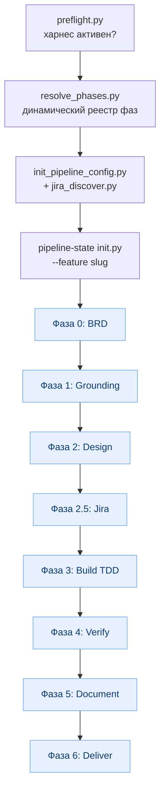
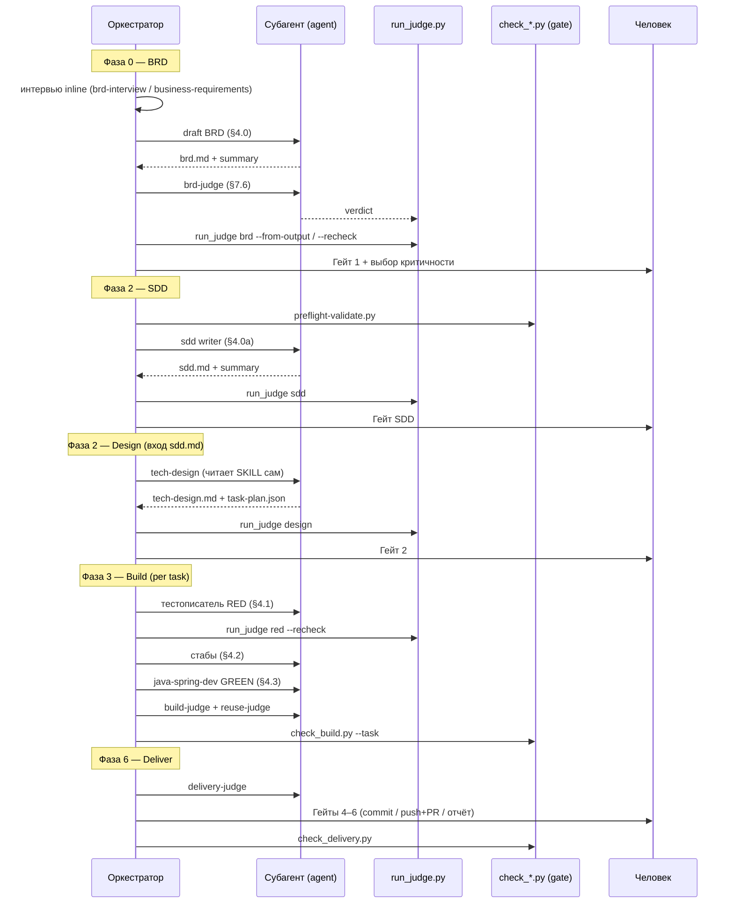
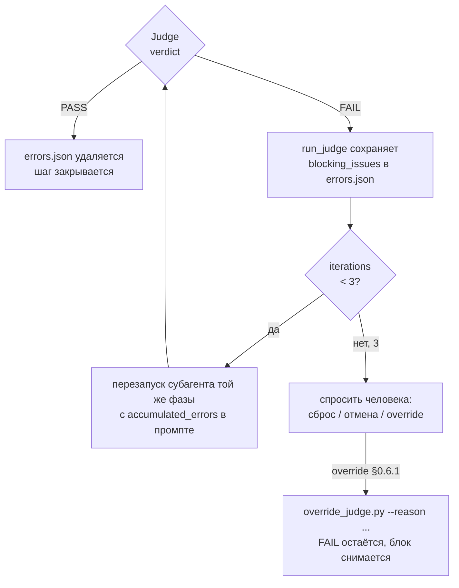

# Feature Pipeline — документ для технических специалистов

> **Кому:** инженеры, кто будет запускать, дорабатывать или дебажить конвейер.
> **О чём:** что именно вызывается на каждой фазе — субагенты, скиллы, судьи (`run_judge.py`),
> execution-gate-скрипты (`check_*.py`), хуки control-plane и шаги манифеста `pipeline-state`.
> Бизнес-обзор — в [pipeline-business.md](pipeline-business.md). Источник правды — `FORGE.md`
> и `skills/feature-pipeline/SKILL.md`.

---

## 0. Архитектурный принцип

**PDLC v3.5: `Pipeline > model; hooks = enforcement; skills = guidance`.**

- **SKILL.md** — guidance: модель может проигнорировать.
- **Хуки (control-plane)** — enforcement: рантайм форсит правила (risk ladder, TDD, evidence,
  token budget, phase-gate). Блокировка = `exit 2` + причина в `stderr`.
- **Судьи + execution-gates** — детерминированные проверки, которые закрывают шаг только при PASS.

> Запуск рантайма обязателен с флагом `--experimental-hooks`, иначе `[HOOK_REGISTRY] 0 hook entries`
> и весь control-plane молчит. Перед прогоном — `preflight.py` (exit 0 = харнес активен).

---

## 1. Полный поток вызовов



**Главное правило исполнения:** фазы Design / Build / Verify / Document выполняются
**ТОЛЬКО через явный вызов `agent(subagent_type="general-purpose", ...)`**, не inline.
Оркестратор лишь: ведёт `pipeline-state`, показывает гейты человеку, вызывает субагентов,
гоняет execution-gates. Inline-исполнение субагентной фазы — баг (теряется изоляция контекста
и устойчивость к обрыву стрима).

---

## 2. Кто что исполняет (механизм)

| Фаза | Исполнитель | Механизм | Гейт человека |
|---|---|---|---|
| Конфиг, чтение Jira-входа, скоуп-чек | главный агент | — | — |
| 0 Discovery (BRD) | интервью inline + BRD-писатель | вложенный скилл + субагент | **Гейт 1** |
| 1 Grounding | `system-analyst` | оркестратор субагентов | Гейт grounding |
| 2 SDD | `sdd` | субагент (контракт §4.0a) | **Гейт SDD** |
| 2 Design (вход — `sdd.md`) | `tech-design` | субагент (читает SKILL сам) | **Гейт 2** |
| 2.5 Jira | `jira-task-writer` | субагент (контракт §4.5) | **Гейт 3** |
| 3 Build (per task) | `java-spring-dev` | субагент, TDD RED→GREEN | — |
| 4 Verify | тестописатель + тестраннер | субагенты | — |
| 5 Document | спецадаптер | субагент general-purpose | — |
| 6 Deliver (per task, stacked) | главный агент | Bitbucket/Jira MCP | **Гейты 4–6** |

> **Вложенный скилл vs субагент:** скилл грузится в контекст оркестратора (может задать вопрос);
> субагент изолирован и возвращает JSON с полем `step_id` (его подхватывает хук `state-recorder`).

> **Таксономия гейтов (во избежание путаницы):** нумерованные **Гейт 1–6** НЕ совпадают с номерами
> фаз `P0–P6`. Именованные гейты (**критичности**, **Grounding**, **SDD**) идут без номера. Все
> **Гейты 4–6 — внутри одной фазы Deliver** (commit / push+PR / отчёт): это три под-гейта доставки,
> а не дубли по фазам Build/Verify/Document (у тех гейтов человека нет). Полный список —
> Гейт 1 → критичности → Grounding → SDD → Гейт 2 → Гейт 3 → Гейт 4 → Гейт 5 → Гейт 6.

---

## 3. Манифест шагов (`pipeline-state`)

State намеспейсится по фиче: `<project>/ground/statements/feature-pipeline/<feature>/`.

> **`ground/` — рантайм-каталог данных в ЦЕЛЕВОМ проекте, не в source-репо Forge.** Его создаёт
> `init.py` (`mkdir(parents=True)`), а `init_pipeline_config.py` кладёт туда `pipeline.json`.
> Отсутствие `ground/` в репозитории Forge — норма, а не дефект: там лежат только `hooks/`+`skills/`,
> а `ground/` появляется в проекте при первом прогоне. Все пути `ground/...` ниже подразумевают
> `<project>/ground/...`.

| step-id | title | depends_on | required_judges |
|---|---|---|---|
| `00-brd` | Discovery / BRD | — | `brd-judge` |
| `01-grounding` | System overview ensured | — | — |
| `02-sdd` | SDD specification (sdd.md) | `00-brd`, `01-grounding` | `sdd-judge` |
| `02-design` | Tech design + task plan | `02-sdd` | `design-judge` |
| `02-eval-plan` | Eval-plan сгенерирован | `02-design` | `eval-judge` |
| `03-jira` | Jira issues created | `02-design` | — |
| `04-test-<taskId>` | TDD RED: тесты падают | `02-design` | `red-judge` |
| `04-build-<taskId>` | TDD GREEN: код зеленит | `04-test-<taskId>`, `02-eval-plan` | `build-judge`, `reuse-judge` |
| `05-tests` | Полный прогон + coverage | все `04-build-*` | `coverage-judge` |
| `06-spec` | Spec updated | `05-tests` | `spec-judge` |
| `07-deliver-<taskId>` | Ветка+коммит+stacked PR | `05-tests`, `06-spec` | `delivery-judge` |
| `07-report` | Отчёт в Story | все `07-deliver-*` | — |

`04-test-*`, `04-build-*`, `07-deliver-*` добавляются после фазы 2 через
`feature-pipeline/scripts/add_steps.py` (он же проставляет `required_judges` и пересобирает gate.json —
версию из `pipeline-state/scripts/` здесь НЕ применять). **Регистр task-id сохраняется**: `T1` → `04-test-T1`.

---

## 4. Детальный sequence: что вызывается по фазам



---

## 5. Фаза за фазой — точные вызовы

### Фаза 0 — Discovery (BRD)
- **Стадия 1 (inline):** интервью по `brd-interview/SKILL.md` или `business-requirements/SKILL.md`
  (3–7 вопросов, БЕЗ полного BRD inline).
- **Стадия 2 (субагент):** BRD-писатель (контракт §4.0 `subagent-prompts.md`) → `docs/feature-pipeline/<slug>/brd.md`.
  Jira-ключ протягивается в шапку `brd.md` → `tech-design.md` → `sdd.md`.
- **Judge:** `brd-judge` (LLM-субагент §7.6 + детерминированная проверка код-токенов):
  ```bash
  run_judge.py brd <slug> --from-output <verdict.json> --project-root <project>
  run_judge.py brd <slug> --recheck --project-root <project>
  ```
- **Гейт 1** + **выбор критичности** → пишет `autonomy.{criticality,auto_max_risk}` в `pipeline.json`
  (low→R2 / medium→R1 / high→R0). До выбора `gate-guard` блокирует любое R2+.

### Фаза 1 — Grounding
- **Детектор:** `system-analyst/scripts/check_grounding.py --root . --json`.
  - exit 0 — переиспользовать (НЕ пересканировать). При `kind=scan` — собрать выжимку (project-grounder §4).
  - exit 1 — запустить `system-analyst` (свой цикл + гейт коммита спеки).
- Свежесть между фичами — инкрементально в фазе 5 (`enrich_grounding.py`), полный рескан не нужен.
- **Гейт grounding** перед переходом к дизайну.

### Фаза 2 — SDD (`02-sdd`)
- `preflight-validate.py` (exit 1 = предыдущий шаг сделан inline → СТОП).
- Субагент `sdd` (контракт §4.0a `subagent-prompts.md`) → строгая спецификация `sdd.md`
  (вход: `brd.md` + `grounding-excerpt.json`). НЕ читать `sdd/SKILL.md` в контекст оркестратора.
- **Judge:** `run_judge.py sdd <slug>` (`sdd-judge`).
- **Гейт SDD** — утверждение спецификации (правки → возврат `sdd`; новое бизнес-требование → откат к BRD
  через `pipeline-state/scripts/rollback.py --to-step 00-brd`: R4-гейт `--dry-run` → «да» → `record_approval`
  → откат; см. `feature-pipeline/references/rollback.md`).

### Фаза 2 — Design (вход — утверждённый `sdd.md`)
- `preflight-validate.py` (exit 1 = предыдущий шаг сделан inline → СТОП).
- `prepare_design_context.py` → `design-context.json` (выжимка grounding под фичу, ~50–200 строк).
- Субагент `tech-design` проектирует ПО `sdd.md` → `tech-design.md`, `task-plan.json`
  (`sdd.md` уже создан на `02-sdd` — НЕ трогает).
- **Judge:** `run_judge.py design <slug>` (`design-judge`).
- **Гейт 2**, затем `add_steps.py` добавляет `02-eval-plan`, `04-test/build-<taskId>`, `07-deliver-<taskId>`.

### Фаза 2 (доп.) — Eval-plan
- `build_evals_from_design.py task-plan.json` → `eval-plan.json` (compile / coverage / test_pass на задачу).
- **Judge:** `eval-judge` (§7.1) + `run_judge.py eval <slug>`. Хук `eval-guard` блокирует запись в `src/main`,
  пока eval'ы задачи не пройдены.

### Фаза 2.5 — Jira
- Субагент `jira-task-writer` (контракт §4.5). **Субагент НЕ вызывает `ask_user_question`** — возвращает
  `pending_questions` (Epic, спринт), вопросы задаёт оркестратор и перезапускает субагента с `answers`.
- Цикл показа черновика → правки (`revision`) → «Да». Создание строго по **подтверждённому** черновику.
- **Гейт 3** + `check_jira.py` (паритет: 1 Story + задача на каждую запись task-plan).

### Фаза 3 — Build (per task, TDD RED→GREEN)
1. **RED** — тестописатель (§4.1): тесты ОБЯЗАНЫ падать на runtime-assert'ах. `check_tests_red.py` (compile OK + fail).
   `red-judge` (§7.2) + `run_judge.py red <slug> --recheck`.
2. **Стабы** сигнатур (§4.2).
3. **GREEN** — `java-spring-dev` (§4.3).
4. `build-judge` (гибрид, §7.3): сохранить verdict.json → `run_judge.py build --from-output` → `--recheck`.
   Ингест сам применяет детерминированный пол stubs (`INGEST_FLOOR_PHASES`) — LLM-PASS на стабах
   не сохранится. `check_build.py --task <taskId>`.
5. `reuse-judge` (§7.7, LLM + regex по git diff): `run_judge.py reuse --from-output ... --diff-base <base>` → `--recheck`.
6. Закрыть `04-build-<taskId>` только когда **оба** судьи PASS.

### Фаза 4 — Verify
- Тестописатель добора покрытия (§4.4), тестраннер (§4.1a).
- **Judge:** `run_judge.py coverage <slug> --recheck` (`coverage-judge` → `check_coverage.py`, JaCoCo
  + floor целостности тестов + floor тавтологичных тестов, дефолт ВКЛ). Закрыть `05-tests`.

### Фаза 5 — Document
- Спецадаптер (§5) правит спеку в `docs_path`.
- `enrich_grounding.py --task-plan ... --feature <slug>` (инкрементально; non-zero → полный рескан).
- `spec-judge` (§7.4) + `run_judge.py spec <slug> --recheck`. Закрыть `06-spec`.

### Фаза 6 — Deliver (per task, stacked)
- `delivery-judge` (гибрид, §7.5): `run_judge.py delivery --from-output` → `--recheck`
  (ингест сам применяет пол секретов, `INGEST_FLOOR_PHASES`). На push `evidence-enforcer`
  дополнительно валидирует сообщение HEAD-коммита (запрет `Co-Authored-By`).
- **Гейт 4** коммиты → **Гейт 5** push + stacked PR (target = ветка-родитель/default) → **Гейт 6** отчёт в Story.
- `check_delivery.py` перед закрытием `07-deliver-<id>` и `07-report`. Ветки stacked по `depends_on`.

---

## 6. Control-plane: хуки

| Хук | Событие | Назначение | Блок |
|---|---|---|---|
| `gate-guard` (+`risk_ladder`, `risk-policy.json`) | PreToolUse Bash/Write/Edit | risk ladder R0–R5, deny-first, форсит выбор критичности | exit 2 |
| `tdd-guard` | PreToolUse Write/Edit | блок `src/main` пока RED-тест задачи (`04-test-<id>`) не completed; блок `@DataJpaTest`/`@SpringBootTest` при `test_layer=service-unit` | exit 2 |
| `eval-guard` | PreToolUse Write/Edit | блок `src/main` пока eval'ы задачи не passed в кэше `evals.json` (read-only; прогон — `run_pending_evals.py`) | exit 2 |
| `sod-enforcer` | PreToolUse Write/Edit/Bash | separation of duties: роль из активного шага манифеста (test не пишет src/main, design не коммитит/пушит/билдит) | exit 2 |
| `inline-phase-guard` | PreToolUse Write/Edit/Bash | actor-guard: ГЛАВНЫЙ агент (пустой `agent_type`) не производит артефакты/код subagent-фазы inline; снимается override `subagent-origin` | exit 2 |
| `destructive-blocker` | PreToolUse Bash | чёрный список (`rm -rf /`, force-push, DROP) | exit 2 |
| `pii-boundary` | PreToolUse Write/Edit/Bash | блок записи PII/scope вне секретов | exit 2 |
| `evidence-enforcer` | PreToolUse Bash | блок доставки без полного evidence bundle | exit 2 |
| `budget-meter` | Post/SubagentStop/Stop | информационный учёт токен-бюджета: budget-события в общий `agents.jsonl` + сводка на Stop (отдельного `budget.json` нет). **Не блокирует и не предупреждает** | — |
| `prompt-guard` | UserPromptSubmit + PostToolUse | детект prompt-injection → additionalContext | — |
| `state-recorder` | SubagentStop | авто-запись шага по `step_id` | — |
| `context-injector` | SubagentStart | инъекция grounding-excerpt/conventions | — |
| `phase-gate` | Stop | блок завершения с висящим `in_progress` | block |
| `log-agent` | все | append-only JSONL аудит | — |

**Порядок (sequential) PreToolUse Bash:** destructive-blocker → evidence-enforcer →
inline-phase-guard → gate-guard → log-agent. **Write/Edit:** pii-boundary → tdd-guard → eval-guard →
sod-enforcer → inline-phase-guard → gate-guard → log-agent. Логгер всегда последний и неблокирующий.

> Гарантию «фаза выполнена ЧЕРЕЗ субагента» держит не PreToolUse-хук (он срабатывает и внутри
> субагента → заблокировал бы его), а `update._check_subagent_origin` на закрытии шага: фазы из
> SUBAGENT_PHASE_PREFIXES закрываются completed только записью от SubagentStop (state-recorder).

> ⚠️ Гейт-хуки **fail-OPEN** при таймауте/краше (>60с убивается → действие проходит). Поэтому тяжёлые
> гейты (`check_taskplan`/`check_delivery`/coverage) гоняет ОРКЕСТРАТОР как execution-gate, а хуки лёгкие
> (file-reads) — страховка. Не клади тяжёлый subprocess в hook hot-path.

---

## 7. Ре-итерация при FAIL и override



- **Error store:** `<project>/ground/statements/feature-pipeline/<slug>/judges/errors.json` — perpetual,
  накапливает ошибки между попытками. Лимит — 3 итерации.
- **Override (§0.6.1)** — последнее средство, только при внешней причине FAIL (нет тестовой БД, внешний
  сервис недоступен) и только с явного согласия. Override НЕ подделывает вердикт — фиксирует, кто и почему снял блок.
- **Никогда** `git push --force` / `git reset --hard` / правка манифеста руками для обхода.

---

## 8. Диагностика и наблюдаемость

```bash
# харнес активен ДО прогона:
python3 <project>/.gigacode/hooks/preflight.py --project .

# какие фичи в работе:
python3 <project>/.gigacode/skills/pipeline-state/scripts/read.py --skill feature-pipeline --list

# живой лог прогона:
bash <project>/.gigacode/hooks/watch-agents.sh

# метрики:
python3 <project>/.gigacode/hooks/agentops.py --archive <home>/ai-logs-archive
```

Логи прогона — один каталог `<project>/ground/ai-logs/run-<session>/` (`agents.log` + `agents.jsonl`,
budget-расход свёрнут в тот же `agents.jsonl`) + единый архив `ai-logs-archive/agents-YYYYMM.jsonl`.

---

## 9. Синхронизация и устойчивость (частые грабли)

- **`agent()` и `ask_user_question` не активны одновременно** — иначе race condition, ответ теряется,
  оркестратор зацикливается (дефект #7 KIDPPRB-8639). Вопросы — строго до запуска субагента или после результата.
- **Делегированные вопросы** субагента — через `pending_questions`, не через `ask_user_question` внутри субагента.
- **Пустой ответ `ask_user_question`** — повтор не более 1 раза, потом текстовое сообщение + fallback.
- **Гигиена контекста:** тяжёлый вывод (gradle/JaCoCo/сканы) — в субагентах; между фазами — `read.py --excerpt-of`,
  не таскать полные выводы.
- **Probe субагентов:** если `agent` недоступен — inline как ДЕГРАДАЦИЯ с явной пометкой и чекпойнтами в state.
